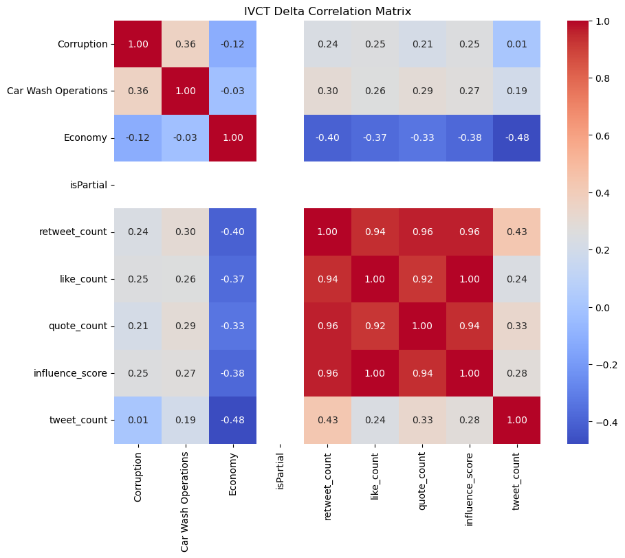
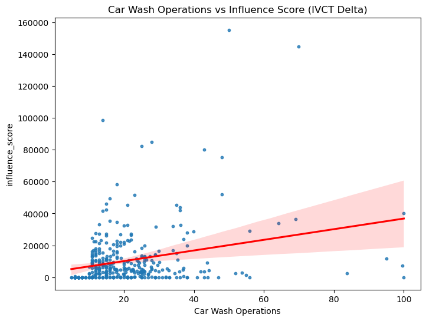
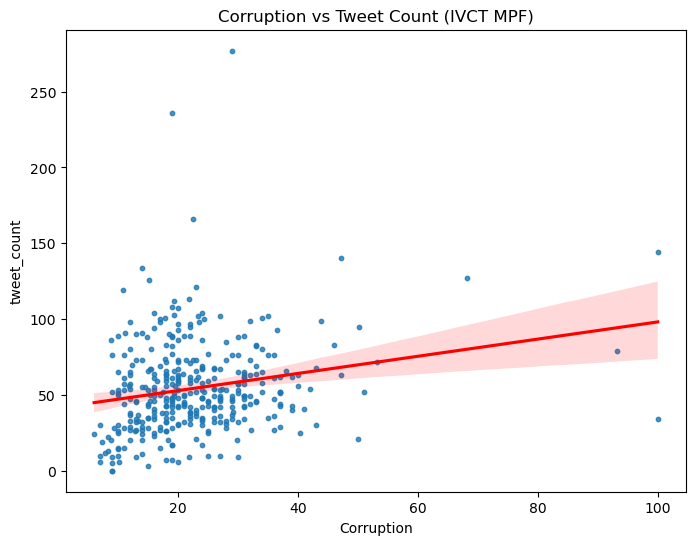

# Search interest and weekly social engagement

Do weekly Google search-interest series move with Twitter engagement, and does any of that association remain after a linear time trend?

This repository merges weekly Google Trends indexes with Twitter engagement extracts, builds an engagement **influence score**, estimates rolling correlations, and fits ordinary least squares with a time-trend control.

Maintainer: Mohamed Fouad.

The statistics below come from the OLS summaries saved in the original notebook run, dated **6 November 2024**. They were read from that output during this cleanup; they were not re-estimated from a fresh download.

## Question

At a weekly frequency, how closely do Google Trends indexes for **Corruption**, **Car Wash Operations**, and **Economy** track Twitter activity, measured as tweet volume and an influence score? The starting point for the project was whether a single weekly correlation was enough, or whether quarterly and yearly views would make event-driven co-movement easier to see.

## Data

Two inputs:

1. **Google Trends weekly indexes** for those three queries, plus Google's `isPartial` flag. The original file was `averaged_weekly_GT_data.csv`. A monthly extract was loaded in the original notebook and was not used in the merge or the regressions.
2. **Tweet-level engagement extracts** for three series, labeled in the source files **IVCT MPF**, **IVCT Delta**, and **HTLJ**. Each row has a timestamp and public engagement counts.

The private extracts are not in this repository. Weekly Google Trends indexes for the same queries can be rebuilt from [Google Trends](https://trends.google.com/). The original notebook read local CSV exports and did not record a public URL for the Twitter/X files.

### Expected schema

**Trends CSV**

| Column | Role |
| --- | --- |
| `Unnamed: 0` or `date` | Week label, parsed as a date |
| `Corruption` | Weekly Google Trends index |
| `Car Wash Operations` | Weekly Google Trends index |
| `Economy` | Weekly Google Trends index |
| `isPartial` | Partial-period flag; excluded from correlations and regressions |

**Twitter CSV** (one file per series)

| Column | Role |
| --- | --- |
| `tweet_created_at` | Tweet timestamp. Timezone-aware values are converted to naive UTC |
| `retweet_count` | Repost count |
| `like_count` | Like count |
| `quote_count` | Quote count |

Week labels on the Trends file need to match the Sunday-ending weeks produced by resampling tweets (`W-SUN`). The original extracts already lined up: the merged IVCT MPF panel has 366 weeks and the IVCT Delta panel has 362 weeks. The preview of the merged IVCT MPF series starts the week of 2014-01-05; IVCT Delta starts the week of 2014-01-19.

### Synthetic sample

`data/sample/` is a small stand-in written by `data/sample/make_sample.py` (NumPy seed 42). The CSVs use the schema above and begin with a `# SYNTHETIC DATA` header. They exist so the script and the notebook can run. Results computed from them are pipeline checks, separate from the published fits.

Put private extracts in `data/raw/` (gitignored) and pass those paths to `analysis.py`.

## Method

For each Twitter series the code:

1. Parses timestamps and drops timezone information.
2. Resamples to weeks ending Sunday. Sums `retweet_count`, `like_count`, and `quote_count`, and counts tweets.
3. Sets **influence score** to the unweighted mean of those three weekly sums.
4. Inner-joins the weekly engagement table to the weekly Trends table on the week timestamp.
5. Computes a Pearson correlation matrix on the weekly numeric columns. `isPartial` is left out.
6. Computes **rolling correlations**: a trailing 12-week Pearson correlation for each headline pair of columns. Each window is a correlation matrix; the chart shows the pairs over time.
7. Computes a **period-mean correlation** (quarterly by default). The original notebook averaged the weekly panel to quarters or years and then correlated those means. That is one matrix for the low-frequency series, not a separate correlation inside each quarter or year.
8. Fits **OLS with a time control**, the same specification as the original notebook:

```
outcome = intercept + coefficient * search_index + coefficient * days_since_first_week + residual
```

`time` is the number of days since the first week of that merged panel. Standard errors are the classical OLS estimator.

The two specifications stored in the original notebook are:

| Series | Outcome | Search index | Overlapping weeks |
| --- | --- | --- | --- |
| IVCT MPF | `tweet_count` | `Corruption` | 366 |
| IVCT Delta | `influence_score` | `Car Wash Operations` | 362 |

## Key findings

**IVCT MPF — weekly tweet count on Corruption and a time trend**

- R² = 0.053, adjusted R² = 0.048, n = 366 (363 residual degrees of freedom)
- F = 10.10, p(F) = 5.37e-05
- Corruption coefficient = 0.4716 (p = 0.001)
- Time coefficient = 0.0039 per day (p = 0.084)

The partial association between the Corruption index and tweet volume is positive, and the equation is detectable as a whole, but it accounts for about five percent of week-to-week variation in tweet counts.

**IVCT Delta — influence score on Car Wash Operations and a time trend**

- R² = 0.272, adjusted R² = 0.268, n = 362 (359 residual degrees of freedom)
- F = 67.17, p(F) = 1.66e-25
- Car Wash Operations coefficient = 299.0704 (p < 0.001)
- Time coefficient = 10.7217 per day (p < 0.001)

This is the stronger fit. The time trend is estimated very sharply, so shared drift is a large part of what the equation explains. About 73 percent of influence-score variance stays in the residual.

The weekly correlation heatmaps from the same run split into two blocks. The Google Trends indexes move together, and the engagement columns move together. Correlations between a search index and an engagement measure are weaker than the correlations inside the engagement block. Part of that engagement block is mechanical: the influence score is the mean of the three summed counts, and tweet count is the number of rows behind those sums. The archived heatmap also includes the `isPartial` flag, which the current script drops before correlating.



*IVCT Delta. Weekly Pearson correlations from the 6 November 2024 notebook run.*



*IVCT Delta. Bivariate scatter of the influence score against the Car Wash Operations index, with an unadjusted trend line. R² = 0.272 is from the OLS that also includes the time trend, so it is a different fit from this line.*



*IVCT MPF. Bivariate scatter of weekly tweet counts against the Corruption index. R² = 0.053 is from `tweet_count ~ Corruption + time`.*

## Caveats

- Both fits leave most of the weekly variation unexplained. R² = 0.053 is a weak fit. R² = 0.272 is only modest.
- Residuals are far from normal. In the tweet-count equation, skewness is 2.163 and kurtosis is 14.331 (Jarque–Bera = 2243.136, probability printed as 0.00; Omnibus probability printed as 0.000). In the influence-score equation, skewness is 4.147 and kurtosis is 30.545 (Jarque–Bera = 12481.992, probability printed as 0.00; Omnibus probability printed as 0.000). A handful of extreme weeks dominate the sums.
- Durbin–Watson statistics are 1.241 and 1.133. Positive autocorrelation remains in the residuals, so the classical standard errors and p-values overstate how precise the coefficients are.
- Condition numbers are 3.65e+03 and 3.56e+03. The time regressor is measured in days, often in the thousands, while the Trends index sits on a 0–100 scale, and that scale gap inflates the condition number. A shared trend can also make the search index and the time control difficult to separate. Read the individual coefficients cautiously.
- The influence score averages retweets, likes, and quotes after they have been summed. Whichever count is largest dominates the score.
- The two regressions use different series and slightly different sets of weeks (n = 366 and n = 362). Tweet counts and the influence score are different units, and a Trends index is a relative score, so the coefficients are not elasticities and are not directly comparable across equations.
- Nothing in the design separates a search-interest effect from news that moves search and posting in the same week.
- Quarterly and yearly heatmaps in the original notebook correlate a short list of period means. Those correlations move around easily and are easy to over-read.
- Running `analysis.py` on `data/sample/` prints different R² values. The numbers in this section are the saved 6 November 2024 summaries.

## How to run

From the repository root:

```bash
python -m venv .venv
source .venv/bin/activate
pip install -r requirements.txt
python analysis.py
```

The script reads `data/sample/`, writes charts to `outputs/figures/`, and writes `outputs/ols_results.json`.

`analysis.ipynb` walks through the same functions on the synthetic sample. To open it:

```bash
pip install jupyter
jupyter notebook analysis.ipynb
```

Private extracts, using the original column names:

```bash
python analysis.py \
  --trends data/raw/averaged_weekly_GT_data.csv \
  --tweets \
      data/raw/df_IVCT_mpf_transfer.csv \
      data/raw/df_IVCT_delta_transfer.csv \
      data/raw/df_HTLJ_transfer.csv \
  --names "IVCT MPF" "IVCT Delta" "HTLJ" \
  --output-dir outputs/private
```

Date columns are detected automatically (`Unnamed: 0` or `date` for Trends; `tweet_created_at` or `tweet_date` for tweets). Override them with `--trends-date-column` and `--tweet-date-column`.

Regenerate the synthetic files:

```bash
python data/sample/make_sample.py
```

Continuous integration (`.github/workflows/ci.yml`) installs `requirements.txt`, runs `python analysis.py` on the synthetic sample, and runs the unit tests.

## Project layout

| Path | Purpose |
| --- | --- |
| `analysis.py` | Load, weekly merge, influence score, rolling correlation, OLS, figures |
| `analysis.ipynb` | Walkthrough of those functions on the synthetic sample |
| `data/sample/` | Synthetic Trends file and two tweet files |
| `figures/` | Three charts exported from the 6 November 2024 notebook run |
| `outputs/` | Created by `analysis.py` (gitignored) |
| `tests/test_analysis.py` | Influence-score formula, merge, rolling window, OLS recovery |

## License

[MIT](LICENSE). Copyright 2025 Mohamed Fouad.
